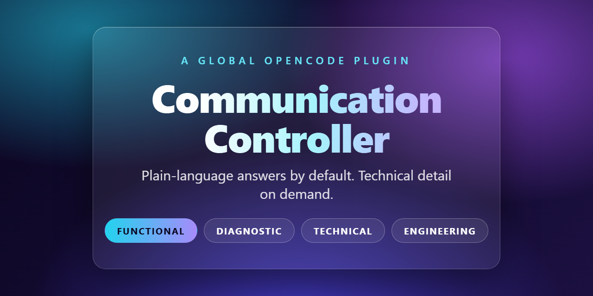

# Communication Controller



A global OpenCode plugin that controls **how OpenCode talks to you**, not what it can do.

- Every session starts in **FUNCTIONAL** mode: what you can do, what you will see, how to use it, what was verified, limitations, what to try next.
- Technical details (files, code, architecture) appear only when you **explicitly ask** or switch modes on purpose.
- An explicit ask ("show me the code") lifts that answer temporarily, then the next answer returns to plain language on its own.

## Modes

| Command | What you get |
|---|---|
| `/functional` | Plain language, no implementation details (default) |
| `/diagnostic` | Debugging help without internals: what fails, what to try |
| `/technical` | Files, code, architecture allowed |
| `/engineering` | Unrestricted engineering detail |
| `/communication` | Show the current mode |
| `/communication reset` | Back to the default |

## Verification

Answers distinguish **VERIFIED WORKING** (actually tested) from **PARTIALLY WORKING**,
**IMPLEMENTED / NOT FULLY VERIFIED**, **NOT VERIFIED**, and **NOT WORKING**.
Uncertainty is never reworded into confidence.

## Install

1. Copy `plugins/communication-controller.js` into your global OpenCode plugins directory.
2. Copy the five `commands/*.md` files into your global OpenCode commands directory.
3. (Optional) Copy `communication-controller.json` next to your global config to change defaults.
4. Restart OpenCode.

## Configuration

`communication-controller.json`:

```json
{
  "defaultMode": "functional",
  "allowExplicitTechnicalRequests": true,
  "strictFunctionalMode": true,
  "investigationNarration": false,
  "verificationAwareness": true,
  "responseValidation": true
}
```

## Tests

```bash
node test.js
```

Drives the plugin hooks directly: default mode, explicit asks, mode pinning,
automatic fallback, session isolation, verification wording, and failure safety.

## How it works

- The active mode's policy is injected right before the model answers (appended in place, so prompt caching is unaffected).
- Your messages are watched for explicit technical requests; matches lift the session temporarily until the turn ends.
- Slash commands perform real switches kept in the plugin's own state — never "remembered" by the model.
- A read-only tripwire logs (never rewrites) when a plain-language answer leaks implementation detail.
- Every hook fails safe: a plugin error degrades to "no policy", never a broken session.

## Disable

Remove the plugin file (and the command files, if desired) from the global
OpenCode directories and restart OpenCode.
